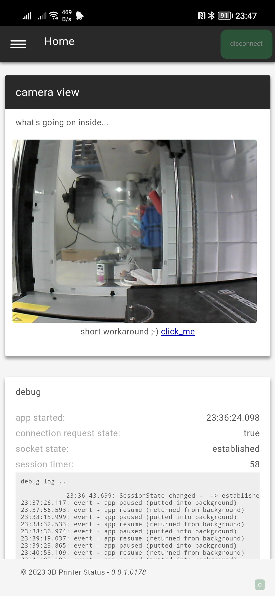
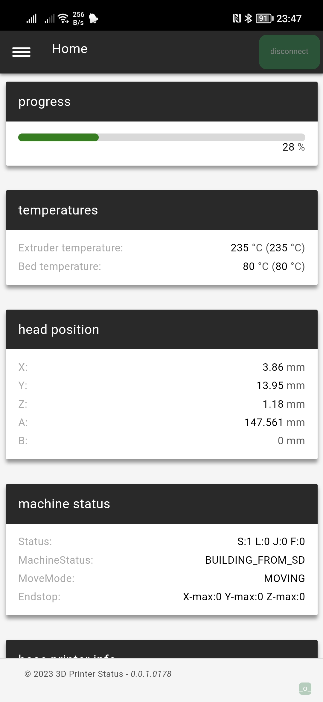
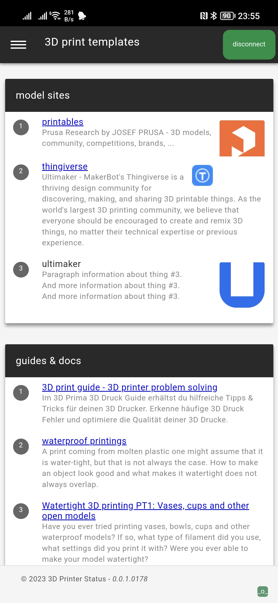
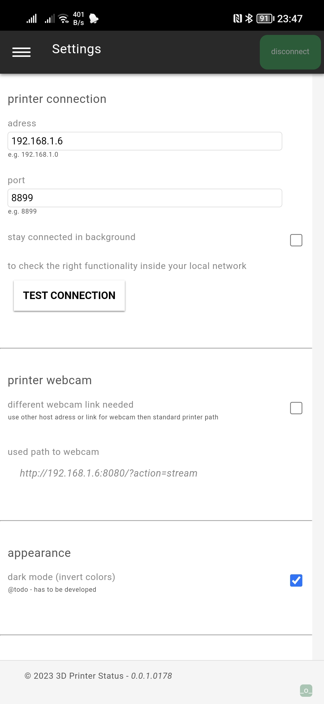
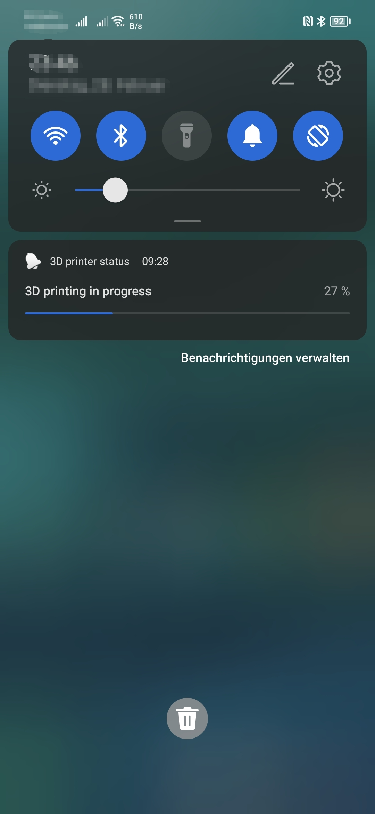
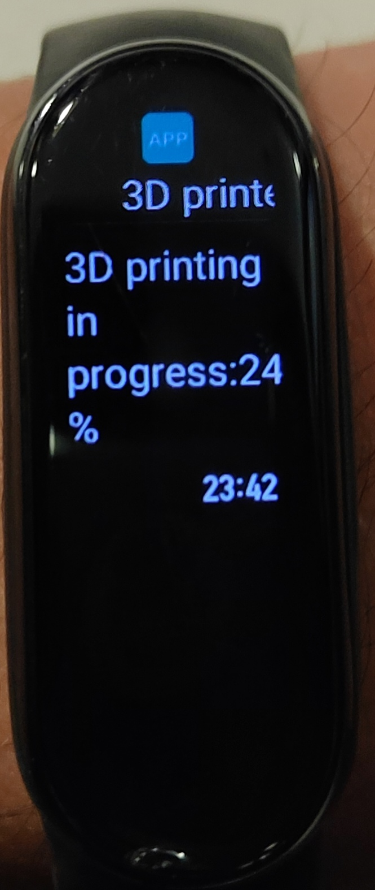

# 3DPrinterStatus

- [3DPrinterStatus](#3dprinterstatus)
  - [release](#release)
  - [development](#development)
  - [description](#description)
- [development status](#development-status)
  - [screenshots](#screenshots)
  - [features planned/ done](#features-planned-done)
  - [info](#info)

## get latest debug build

## description
project is written in NodeJS and built with cordova
currently only builds for android available

# development status
 

## screenshots

## features planned/ done
- open content the app recognized the finish state of the current job. This state could trigger a smart plug with MQTT or IFTTT. So it is maybe possible to integrate with a specific call on an url or direct MQTT integration.
- open content prevent connection with default values or inform user about the try to connect with default values
- done UX animation of changed values from printer, to recognize easily the changed value
- open UX button connect should be according to the current session state (currently: state info with butto color and button text without a direct understandable connection)
- done UX IP of printer should be directly take over for the webcam or at least offered
- open content also offer modeling tools e.g. freeCAD oder tinkerCAD
- open content offer temperature graph
- open content idea -> visualize current layer of printing with the XYZ data (why? Don't know! ;-) )
- open UX darkmode: invert colors to get dark environment
- open UX darkmode: switch darkmode with systemsettings
- open UX notification: local push notification, if printer job is done
- open UX notification: local push notification, if printer stopped before done, e.g. filament error (empty)
- open UX notification: progess should be optionally shown as an notification
- open content searching for printer in the local network, present result and give the option to take over to the printer connection
- open content show the video stream of webcam directly inside the app
- done UX notification: local push notification with progress as a permanent info during printing
- open UX notification: should be switchable on/off in settings
- done content stablize session to the printer - re-connect if connection lost, but the user still required an open connection (connect button -> not manually disconnected)
- done content notification: local single push notification every 10% during printing

## info
- current usage (at least until 0.0.1.0172) of connect/ disconnect button colors -> orange = is initialized / green = is connected / red = error occured (check debug log, e.g. BLOCKED means PC has already active connection to printer)/ blue = session releasing or finished
- "Bresser REX" offer itself as a "Flashforge Adventurer III"